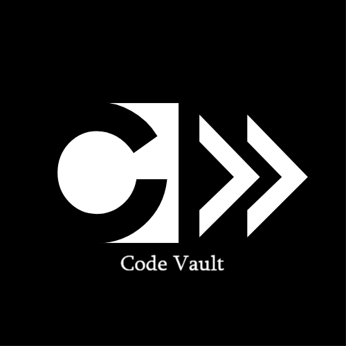

# CODE VAULT-Code Analyzer
  

  A command-line static code analyser based on **C++** programming language and terminal operations. Easy to use and **get insights and anaysis reports** for code written by developers or coders.

## Documentation 📄
  The documentation for this application is available at <**weblink***> 
## Features ⚙️⚙️

## Tech Stack🚀

## How does it work ❓

## Future Upgrades 🛰️

## How to run ?🔛

## Readme Add-ons ➕

#### Author
***tecnolgd***
